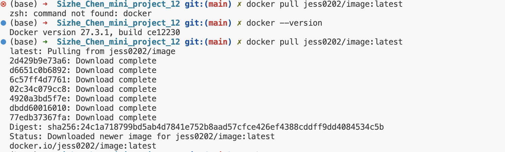
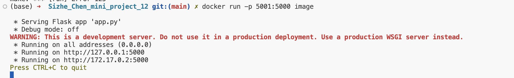

# IDS706 mini project 12 by Sizhe Chen

[](https://github.com/nogibjj/Sizhe_Chen_mini_project_12/actions/workflows/build.yml)

---
title: "Flask Application Dockerization"
author: "Sizhe Chen"
date: "`r Sys.Date()`"
output: 
  html_document:
    toc: true
    toc_depth: 2
---

# Project Overview

This project demonstrates the Dockerization of a Flask application and deployment using Docker. The application performs basic mathematical operations like addition and multiplication via HTTP requests.

---

# Project Files

- `app.py`: Contains the Flask application code.
- `Dockerfile`: Used to create the Docker image for the application.
- `requirements.txt`: Lists the Python dependencies for the Flask application.
- `Makefile`: Includes commands to build and run the Docker container easily.

---

```
project-folder/
│
├── app.py
├── Dockerfile
├── requirements.txt
├── Makefile
├── .gitignore
├── README.md
├── image1.png
├── image2.png

```
# Docker Commands Used

### Building the Docker Image
```
docker build -t image .
```
### Docker Build Output


### Docker Run Output
