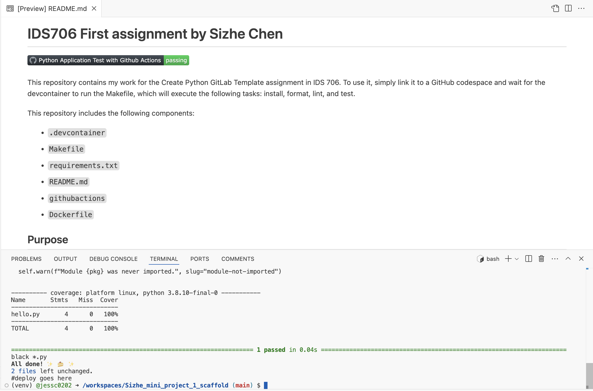

# IDS706 First assignment by Sizhe Chen

[](https://github.com/nogibjj/Sizhe_mini_project_1_scaffold/actions/workflows/cicd.yml)

This repository holds my work for the Create Python Template assignment in IDS 706. 

This repository includes the following components:

* `.devcontainer/`: Contains the Docker configuration and environment settings for consistent development.

* `Makefile`: Defines commands for setup, testing, linting, and other tasks.

* `requirements.txt`: Lists the dependencies required for the project.

* `README.md`: This file contains an overview of the project.

* `.github/actions/`: Contains the GitHub Actions configuration for CI/CD.

* `Dockerfile`: Used for building the Docker container for the project.

* `LICENSE`: License for the project.

* `hello.py`: Main Python script containing the core logic of the project.

* `test_hello.py`: Test cases for verifying the functionality of `hello.py`.

## Purpose
The purpose of this project is to have a Python template with a hello.py file containing a function called add(x,y) that takes two numbers as input and add them together. 

## Preparation

To use this project:

1. Open the repository in **GitHub Codespaces**.
2. The environment will automatically configure itself using the `.devcontainer` setup.

## Usage

To run the project and execute the function `add`:

1. Ensure that dependencies are installed:
   ```bash
   make install


